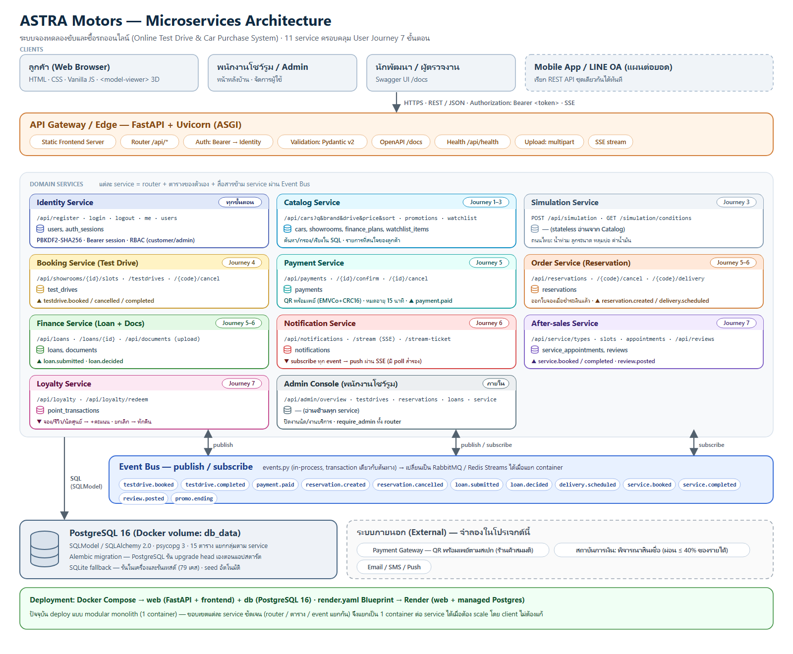
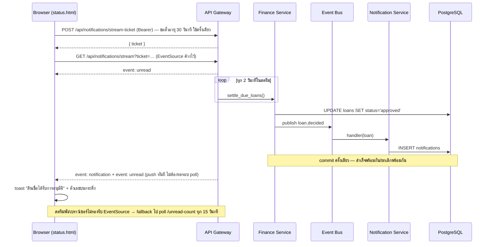
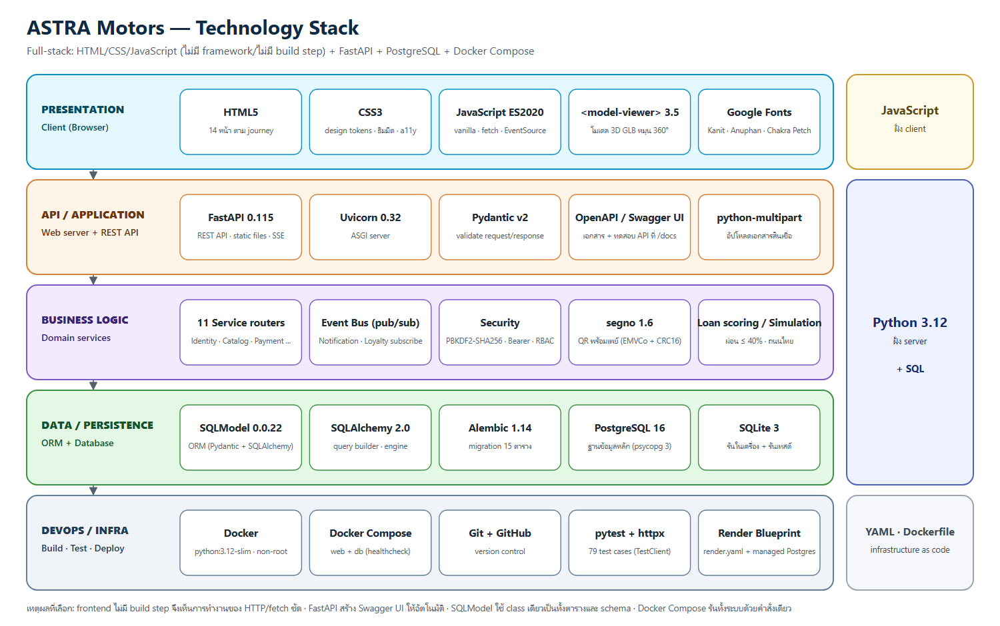
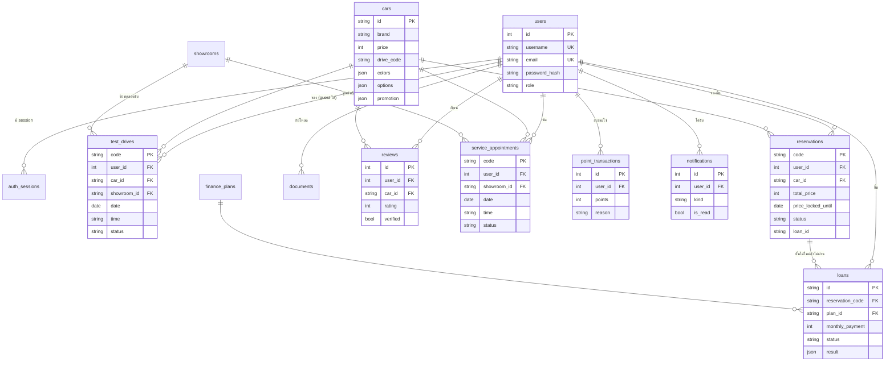

# สถาปัตยกรรมระบบ ASTRA Motors

ระบบจองทดลองขับและซื้อรถออนไลน์ (Online Test Drive & Car Purchase System) — ครอบคลุม User Journey 7 ขั้นตอน
(ดูการจับคู่ขั้นตอน → หน้าจอ → API ใน [`user-journey.md`](user-journey.md))

## 1. Microservices Architecture

ไฟล์ต้นฉบับแบบเวกเตอร์: [`architecture/microservices-architecture.svg`](architecture/microservices-architecture.svg)

### ชั้นของระบบ (บนลงล่าง)

| ชั้น | หน้าที่ | อยู่ในโค้ดที่ |
|---|---|---|
| Clients | เว็บเบราว์เซอร์ของลูกค้า/ผู้ดูแลระบบ และ Swagger UI สำหรับนักพัฒนา | `frontend/` |
| API Gateway / Edge | จุดเข้าเดียวของทุก request: serve ไฟล์หน้าเว็บ, route `/api/*`, ตรวจ Bearer token, validate ข้อมูลด้วย Pydantic, สร้างเอกสาร OpenAPI | `backend/app/main.py`, `security.py` |
| Domain Services | 9 service แยกตามโดเมนธุรกิจ — แต่ละตัวเป็นเจ้าของ router และตารางของตัวเอง | `backend/app/routers/*.py` |
| Event Bus | service ต้นทางประกาศ event (เช่น `reservation.created`) ส่วน service ปลายทางสมัครรับเอง ไม่ต้องเรียกกันตรง ๆ | `backend/app/events.py` |
| Data | PostgreSQL 16 ผ่าน SQLModel (ORM) — SQLite ใช้ตอนรันในเครื่องและรันเทสต์ | `models.py`, `database.py`, `seed.py` |
| External (จำลอง) | Payment gateway, สถาบันการเงิน, Email/SMS | ตรรกะจำลองใน `bookings.py`, `loans.py` |

### รายการ service

| Service | Journey | Endpoint หลัก | ตารางที่เป็นเจ้าของ | Event |
|---|---|---|---|---|
| Identity | ทุกขั้นตอน | `/api/register` `/api/login` `/api/logout` `/api/me` `/api/users` | `users`, `auth_sessions` | — |
| Catalog | 1–3 | `/api/cars` (ค้นหา/กรอง/เรียง) `/api/cars/facets` `/api/promotions` `/api/showrooms` `/api/finance/plans` | `cars`, `showrooms`, `finance_plans` | — |
| Simulation | 3 | `POST /api/simulation` `/api/simulation/conditions` | — (stateless) | — |
| Booking | 4 | `/api/showrooms/{id}/slots` `/api/testdrives` `/api/testdrives/{code}/cancel` | `test_drives` | publish `testdrive.booked`, `testdrive.cancelled` |
| Order | 5–6 | `/api/reservations` `/{code}/cancel` `/{code}/delivery` `/api/me/bookings` | `reservations` | publish `reservation.created`, `reservation.cancelled`, `delivery.scheduled` |
| Finance | 5–6 | `/api/loans` `/api/loans/{id}` `/api/documents` | `loans`, `documents` | publish `loan.submitted`, `loan.decided` |
| After-sales | 7 | `/api/service/types` `/api/service/slots` `/api/service/appointments` `/api/reviews` | `service_appointments`, `reviews` | publish `service.booked`, `service.cancelled`, `review.posted`, `review.deleted` |
| Notification | 6 | `/api/notifications` `/unread-count` `/read-all` `/stream-ticket` `/stream` (SSE push) | `notifications` | subscribe ทุก event ที่ลูกค้าควรรู้ — ส่งถึงเบราว์เซอร์แบบ push (SSE) และมี poll เป็น fallback |
| Loyalty | 7 | `/api/loyalty` `/api/loyalty/redeem` | `point_transactions` | subscribe จอง/รีวิว/นัดศูนย์ (+คะแนน) และการยกเลิก (หักคืน), publish `points.redeemed` |

### ตัวอย่างการไหลของ event: ผลสินเชื่อออก → ลูกค้าเห็นแจ้งเตือน (SSE push, poll เป็น fallback)

### สถานะการแยก service (ตรงไปตรงมา)

ตอนนี้ deploy แบบ **modular monolith** — ทุก service รันใน process/container เดียว (`web`) คู่กับ `db`
แต่ขอบเขตของแต่ละ service ถูกแยกไว้แล้วครบ 3 ชั้น จึงแยกออกเป็น container ละ service ได้เมื่อจำเป็น:

1. **API แยก** — แต่ละ service มี router และ prefix ของตัวเอง → API Gateway (เช่น Nginx/Traefik) route ตาม prefix ได้ทันที
2. **ข้อมูลแยก** — แต่ละตารางมีเจ้าของ service เดียว (service อื่นอ่านผ่าน helper ใน `crud.py`)
3. **การสื่อสารแยก** — Notification/Loyalty ไม่ถูกเรียกตรง ๆ แต่รับ event → เปลี่ยน `events.py` เป็น RabbitMQ/Redis Streams
   ได้โดยไม่แก้ service ต้นทาง

## 2. Technology Stack

ไฟล์ต้นฉบับแบบเวกเตอร์: [`architecture/tech-stack.svg`](architecture/tech-stack.svg)

| ชั้น | เทคโนโลยี | ใช้ทำอะไร |
|---|---|---|
| Presentation | HTML5, CSS3, JavaScript (ES2020, ไม่มี framework/build step), `<model-viewer>` 3.5, Google Fonts | 13 หน้าตาม journey, โมเดล 3D หมุน 360°, เรียก API ด้วย `fetch()` |
| API / Application | FastAPI 0.115, Uvicorn 0.32, Pydantic v2, OpenAPI/Swagger UI, python-multipart | REST API + serve หน้าเว็บ, validate ข้อมูล, เอกสาร API ที่ `/docs`, อัปโหลดไฟล์ |
| Business logic | 9 service routers, Event bus, PBKDF2-SHA256 + Bearer token + RBAC | กติกาทางธุรกิจ, สิทธิ์การเข้าถึง, แจ้งเตือน/คะแนนแบบ event-driven |
| Data | SQLModel 0.0.22, SQLAlchemy 2.0, psycopg 3, PostgreSQL 16, SQLite | ORM + ฐานข้อมูลหลัก (Docker) + ฐานข้อมูลตอนพัฒนา/เทสต์ |
| DevOps | Docker, Docker Compose, Git/GitHub, pytest + httpx, Render/Railway | รันทั้งระบบด้วยคำสั่งเดียว, เทสต์อัตโนมัติ 41 เคส, deploy ด้วย Dockerfile เดิม |

## 3. โครงสร้างข้อมูล (ER diagram)

